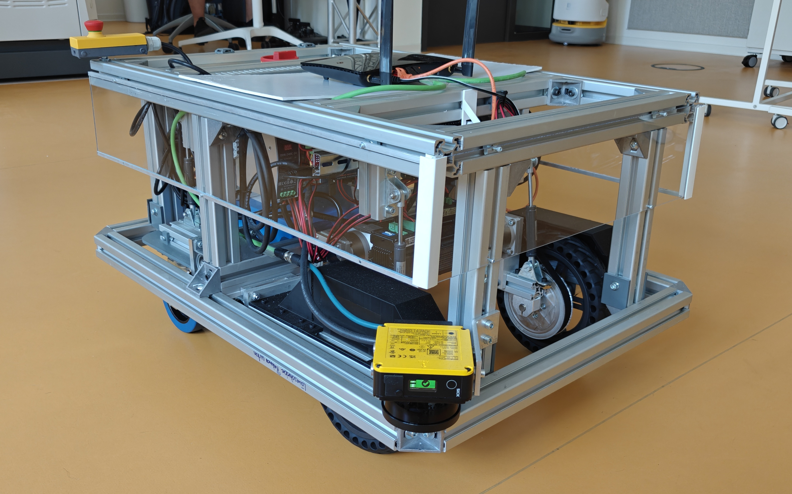
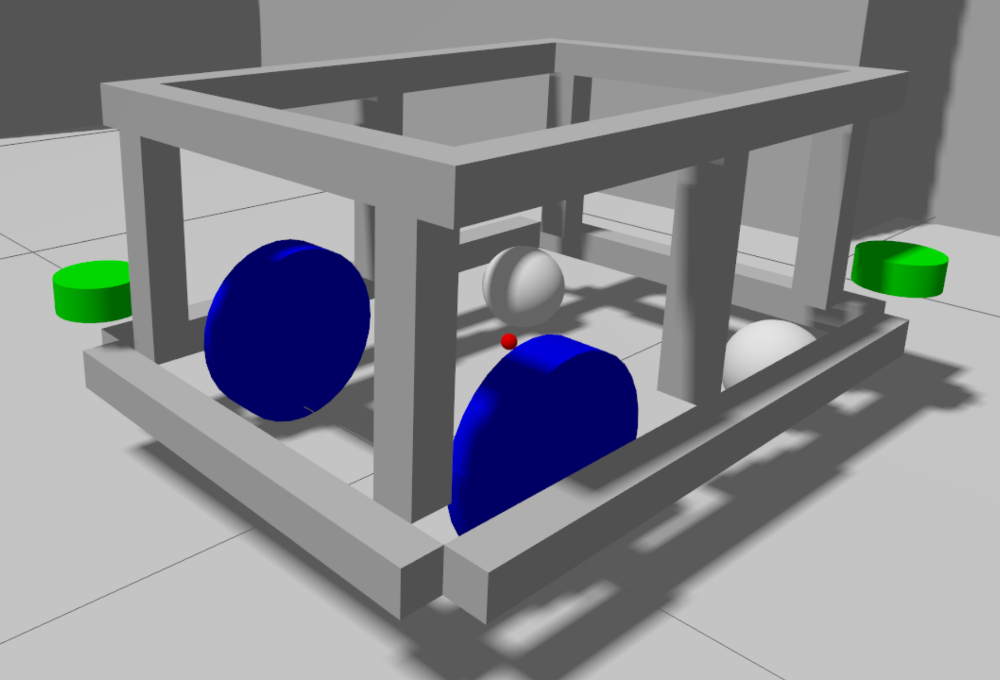
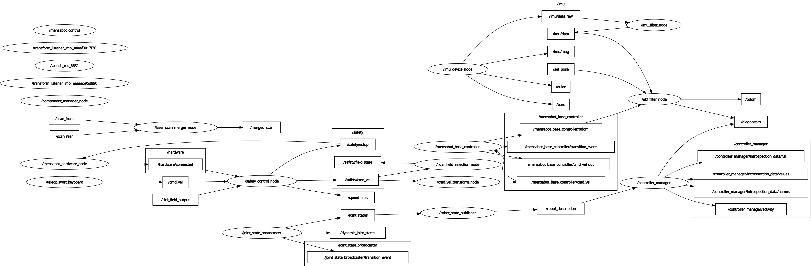

# HSK-Mensabot


## A ROS2-Based Autonomous Mobile Robot Platform

Developed at **Kempten University of Applied Sciences (Hochschule Kempten)**.

The **HSK-Mensabot** project is a ROS2-based mobile robot platform designed for autonomous indoor navigation. It combines modern navigation algorithms, hardware abstraction, integrated safety monitoring, and simulation into a unified software architecture. The system supports both simulation and real-world operation while maintaining a nearly identical software stack for both environments.

The API documentation can be found here: https://fabcode288.github.io/HSK-Mensabot/index.html

---

# Table of Contents

- [Project Overview](#project-overview)
- [Features](#features)
- [System Architecture](#system-architecture)
- [Repository Structure](#repository-structure)
- [Hardware Overview](#hardware-overview)
- [Software Stack](#software-stack)
- [Installation](#installation)
- [Running the System](#running-the-system)
- [Repository Packages](#repository-packages)
- [Documentation](#documentation)
- [Third-Party Projects](#third-party-projects)
- [License](#license)
- [Acknowledgements](#acknowledgements)

---

# Project Overview

<p align="center">
  
  
</p>

The software architecture has been developed with a strong focus on modularity, maintainability, and hardware abstraction. The project demonstrates how ROS2 can be used to integrate navigation, localization, hardware control, and functional safety into a single robotic platform.

The repository contains all software required to operate the robot, including simulation, navigation, hardware drivers, utility nodes, launch files, and Arduino firmware.

---

# Features

- ROS2 Jazzy based software architecture
- Ubuntu 24.04 LTS
- Autonomous navigation using Nav2
- SLAM Toolbox for map creation
- AMCL localization
- Differential drive robot
- ros2_control hardware interface
- Custom Arduino motor communication protocol
- Dual SICK NanoScan3 safety scanners
- Dynamic safety field selection
- Dynamic Nav2 footprint adaptation
- RF2O laser odometry
- Extended Kalman Filter localization
- Gazebo simulation environment
- Nearly identical simulation and real robot software architecture

---

# System Architecture

<p align="center">
  
</p>

The robot software is organized into multiple independent ROS2 packages. Navigation, localization, hardware control, safety, monitoring, and simulation are implemented as separate components communicating via ROS2 topics, services, and actions.

A detailed description of the complete software architecture is available in: **[docs/architecture](docs/architecture)**.

---

# Repository Structure

```

ros2_mensabot_ws/

├── arduino_code/
├── docs/
├── scripts/
├── src/
├── README.md
└── LICENSE

```

| Folder | Description |
|----------|-------------|
| arduino_code | Arduino firmware used for motor control |
| docs | Complete project documentation |
| scripts | Installation and setup scripts |
| src | ROS2 workspace packages |

---

# Hardware Overview

The current hardware platform consists of:

| Component | Model |
|------------|-------------------------------|
| Embedded Computer | Raspberry Pi 5 |
| Microcontroller | Arduino Uno |
| IMU | Yahboom IMU |
| Safety Scanner | 2× SICK NanoScan3 |
| Drive Motors | 2× JMC iHSV57 Servo Motors |
| Drive Type | Differential Drive |

For detailed hardware information, see the **[docs/hardware](docs/hardware)**.

---

# Software Stack

| Software | Version |
|------------|-------------|
| Ubuntu | 24.04 LTS |
| ROS2 | Jazzy Jalisco |
| Gazebo | Harmonic |
| Nav2 | Jazzy |
| SLAM Toolbox | Latest ROS2 Jazzy Release |
| robot_localization | Jazzy |
| ros2_control | Jazzy |

---

# Installation

Create a new ROS2 workspace and clone the repository:

```bash
mkdir -p ~/ros2_mensabot_ws/
cd ~/ros2_mensabot_ws/

git clone https://github.com/FabCode288/HSK-Mensabot.git

colcon build --symlink-install

source install/setup.bash
```

A complete installation guide, including Raspberry Pi setup, required dependencies, and USB (udev) configuration, is available in the **[Installation Guide](docs/installation/)**.

---

# Running the System

## Simulation

Start the complete simulation:

```bash
ros2 launch mensabot_bringup sim_complete_bringup.launch.py
```

Start the simulation without navigation and localization:
```bash
ros2 launch mensabot_bringup sim_bringup.launch.py
```

Further information: **[docs/simulation](docs/simulation)**.


---

## Real Robot

Start the complete robot on the Raspberry Pi:

```bash
ros2 launch mensabot_bringup real_complete_bringup.launch.py
```

Start the robot without navigation and localization:
```bash
ros2 launch mensabot_bringup real_bringup.launch.py
```

Start the robot without navigation and localization while performing a LiDAR reset:
```bash
ros2 launch mensabot_bringup real_bringup.launch.py lidar_reset:=true
```

Start RViz on your computer:
```bash
ros2 launch mensabot_bringup real_rviz.launch.py
```

Detailed launch descriptions are available in: **[docs/launch](docs/launch)**.

---

## Monitoring

Start an external GUI for debugging information:
```bash
python3 src/mensabot_utils/mensabot_utils/mensabot_monitor.py
```

For morme detailed information: **[docs/monitoring](docs/monitoring/)**.

# Repository Packages

| Package | Description |
|----------|-------------|
| mensabot_bringup | Launch files for simulation and real robot |
| mensabot_description | Robot description and URDF |
| mensabot_navigation | Navigation and localization configuration |
| mensabot_hardware | ros2_control hardware interface |
| mensabot_utils | Utility and safety nodes |
| mensabot_simulation | Gazebo simulation environment |
| laser_scan_merger | Laser scan merging package |
| rf2o_laser_odometry | RF2O laser odometry |
| imu_ros2_device | IMU driver |

Each package contains its own README with additional documentation.

---

# Documentation

Additional documentation can be found in the **[docs/](docs/)** directory.

| Documentation | Description |
|---------------|-------------|
| Architecture | Overall software architecture |
| Installation | Complete installation guide |
| Hardware | Hardware documentation and datasheets |
| Navigation | Navigation configuration |
| Safety | Safety concept |
| Communication | Arduino communication protocol |
| Simulation | Gazebo simulation |
| Monitoring | Mensabot Monitor |
| USB Configuration | USB mapping and udev rules |
| Launch Files | Launch file documentation |
| Third-Party Software | External open-source software and licenses ([Third_Party.md](Third_Party.md)) |
---

# Third-Party Software

This project integrates several third-party open-source components from the ROS ecosystem.

A complete overview of all external dependencies, their purpose, repository links, and applicable licenses is available in the **[Third-Party Software Overview](Third_Party.md)**.

Please refer to the respective repositories for licensing information.

---

# License

This repository contains software developed as part of the **HSK-Mensabot** project at **Kempten University of Applied Sciences**.

Third-party software remains subject to its respective license.

---

# Acknowledgements

This project was developed at

**Kempten University of Applied Sciences (Hochschule Kempten)**

as part of the **HSK-MensaBot** project.

Special thanks to everyone involved in the development of the robot platform and to the open-source ROS community for providing the software foundation used throughout this project.