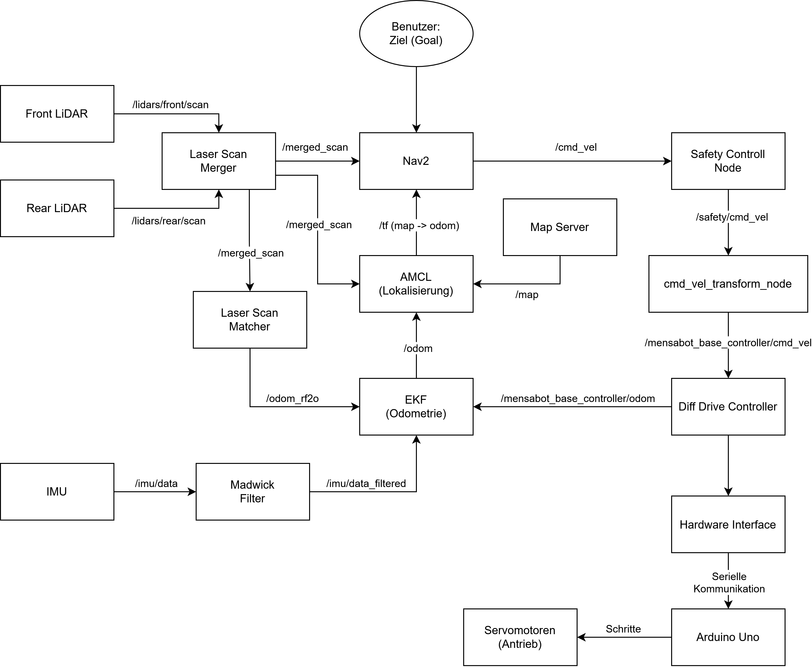

# Software Architecture

The HSK-Mensabot software is built around a modular ROS2 architecture. Each functional subsystem is implemented as an independent ROS2 package with clearly defined responsibilities and standardized communication interfaces. This separation improves maintainability, simplifies testing, and allows simulation and real hardware to share the same software architecture with only minimal hardware-specific differences.

The following sections provide an overview of the repository structure, software architecture, package organization, data flow, and design principles used throughout the project.

---

# 1. Repository Architecture

The repository is organized into four primary components.

```text
HSK-Mensabot/

├── Arduino_Code/
├── docs/
├── scripts/
├── src/
├── README.md
├── LICENSE
└── THIRD_PARTY.md
```

| Directory      | Description                                                                                           |
| -------------- | ----------------------------------------------------------------------------------------------------- |
| `Arduino_Code` | Arduino firmware responsible for motor communication and low-level control.                           |
| `docs`         | Complete project documentation, including hardware, software, installation, safety, and architecture. |
| `scripts`      | Utility scripts such as the Raspberry Pi setup script.                                                |
| `src`          | ROS2 workspace containing all project packages and external dependencies.                             |

The repository is designed to keep documentation, hardware-specific files, utility scripts, and ROS2 packages clearly separated.

---

# 2. System Architecture

The software consists of several independent subsystems connected through ROS2 topics, services, actions, and the TF framework.

<p align="center">
  
</p>

The architecture follows a layered design:

* Sensor Layer
* Localization Layer
* Navigation Layer
* Safety Layer
* Motion Control Layer
* Hardware Layer

This separation allows individual components to be developed, tested, and replaced independently.

---

# 3. Software Execution Pipeline

The overall execution flow of the software is illustrated below.

1. Sensors acquire environmental and motion data.
2. Sensor data is fused to estimate the current robot pose.
3. The navigation system calculates the desired robot motion.
4. The safety system validates the commanded motion.
5. Motion commands are transformed into wheel velocities.
6. The hardware interface transmits commands to the motor controller.
7. The robot executes the requested movement.

Although individual components operate independently, this pipeline represents the logical flow of information during normal robot operation.

---

# 4. Package Overview

The ROS2 workspace consists of several dedicated packages.

| Package                | Responsibility                                        |
| ---------------------- | ----------------------------------------------------- |
| `mensabot_bringup`     | Launch files for simulation and real robot operation  |
| `mensabot_description` | Robot description, URDF, meshes and robot model       |
| `mensabot_navigation`  | Navigation, localization and controller configuration |
| `mensabot_hardware`    | ros2_control hardware interface                       |
| `mensabot_simulation`  | Gazebo simulation environment                         |
| `mensabot_utils`       | Utility nodes, safety nodes and supporting tools      |
| `laser_scan_merger`    | Merges multiple LiDAR scans into a single LaserScan   |
| `rf2o_laser_odometry`  | Laser-based odometry estimation                       |
| `imu_ros2_device`      | IMU driver                                            |
| `sick_safetyscanners2` | ROS2 driver for the SICK NanoScan3 safety scanners    |

Each package contains its own README with additional implementation details.

---

# 5. Node Architecture

Each major software component is implemented as an individual ROS2 node.

<p align="center">
  
</p>

The most important project-specific nodes are summarized below.

| Node                       | Purpose                                                          |
| -------------------------- | ---------------------------------------------------------------- |
| Safety Control Node        | Monitors safety scanners, emergency stop and speed limitations   |
| CmdVel Transform Node      | Converts velocity commands for the differential drive controller |
| LiDAR Field Selection Node | Selects the active safety field depending on robot state         |
| LiDAR Reset Node           | Performs automatic scanner reset during startup                  |
| Simulation Publisher       | Simulates hardware interfaces in Gazebo                          |
| Odom Logger                | Records odometry information for testing and evaluation          |
| Mensabot Monitor           | Graphical monitoring application for robot status                |

Additional ROS2 nodes such as Nav2, AMCL, SLAM Toolbox, robot_localization and ros2_control are provided by their respective ROS packages.

---

# 6. Data Flow

The complete software architecture can be divided into four independent processing pipelines.

---

## 6.1 Navigation

```text
LiDAR
      │
      ▼
Laser Scan Merger
      │
      ▼
AMCL
      │
      ▼
Nav2 Planner
      │
      ▼
Controller Server
```

The navigation stack receives a merged laser scan, estimates the robot pose, computes a collision-free path and generates velocity commands.

---

## 6.2 Localization

```text
Wheel Odometry

Laser Odometry

IMU
      │
      ▼
Extended Kalman Filter
      │
      ▼
Filtered Odometry
      │
      ▼
AMCL
```

Localization combines multiple sensor sources using an Extended Kalman Filter to obtain a robust pose estimate for navigation.

---

## 6.3 Motion Control

```text
Nav2
      │
      ▼
Safety Control
      │
      ▼
CmdVel Transform
      │
      ▼
Diff Drive Controller
      │
      ▼
Hardware Interface
      │
      ▼
Arduino
      │
      ▼
Servo Motors
```

The motion control pipeline transforms navigation commands into motor commands while ensuring that all safety constraints are respected.

---

## 6.4 Safety

```text
NanoScan3 Front

NanoScan3 Rear
        │
        ▼
Safety Control Node
        │
        ├── Emergency Stop
        ├── Speed Limitation
        └── Safety State
```

The Safety Control Node continuously supervises both safety scanners and determines whether the robot may continue operating, must reduce its speed, or has to perform an emergency stop.

Detailed information is available in the **Safety Documentation**.

---

# 7. TF Tree

ROS2 uses the TF framework to maintain the spatial relationship between all coordinate frames.

<p align="center">
  
</p>
The TF tree contains the robot base frame, wheel frames, sensor frames, odometry frame and map frame. This allows all navigation and localization components to operate within a common coordinate system.

---

# 8. Simulation and Real Robot

One of the primary design goals of the project is to use nearly identical software for simulation and the physical robot.

| Component          | Simulation    | Real Robot                      |
| ------------------ | ------------- | ------------------------------- |
| Robot Model        | Gazebo        | Physical Robot                  |
| LiDAR              | Gazebo Sensor | 2× SICK NanoScan3               |
| IMU                | Gazebo IMU    | Yahboom IMU                     |
| Motor Driver       | Gazebo Plugin | Arduino Controller              |
| Hardware Interface | Simulated     | ros2_control Hardware Interface |
| Navigation         | Identical     | Identical                       |
| Safety Logic       | Identical     | Identical                       |

Only hardware-specific interfaces differ between both operating modes. Navigation, localization, safety logic, configuration files and most launch files remain unchanged.

---

# 9. Design Principles

The software architecture is based on the following principles.

* Modular ROS2 package structure
* Separation of hardware and application logic
* Unified architecture for simulation and real hardware
* Hardware abstraction using ros2_control
* Standardized ROS2 communication interfaces
* Reusable launch configuration
* Independent software components with clearly defined responsibilities
* Easy extensibility for additional sensors and hardware

These principles simplify maintenance, improve code readability and allow new hardware components to be integrated with minimal modifications to the existing software architecture.

---

# Related Documentation

Further information about individual subsystems can be found in the following documentation:

* **[Installation Guide](../installation/)**
* **[Hardware Documentation](../hardware/)**
* **[Launch Documentation](../launch/)**
* **[Navigation Documentation](../navigation/)**
* **[Safety Documentation](../safety/)**
* **[Communication Documentation](../communication/)**
* **[Simulation Documentation](../simulation/)**
* **[Monitoring Documentation](../monitoring/)**

Each document focuses on one subsystem and provides implementation details, configuration parameters, and additional diagrams where appropriate.
