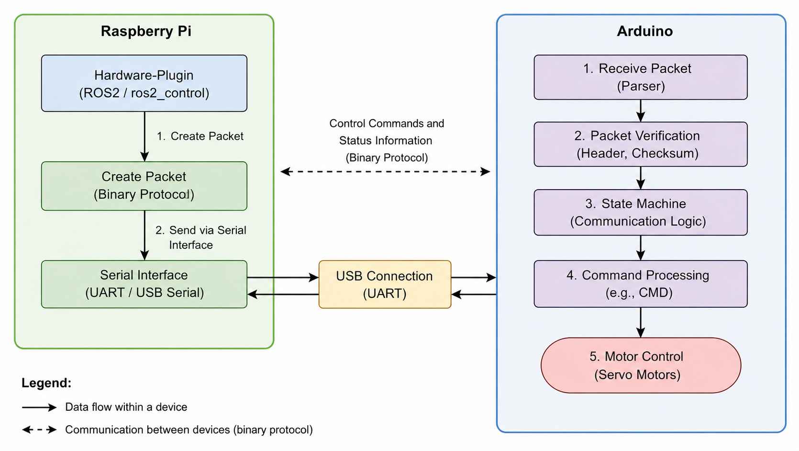
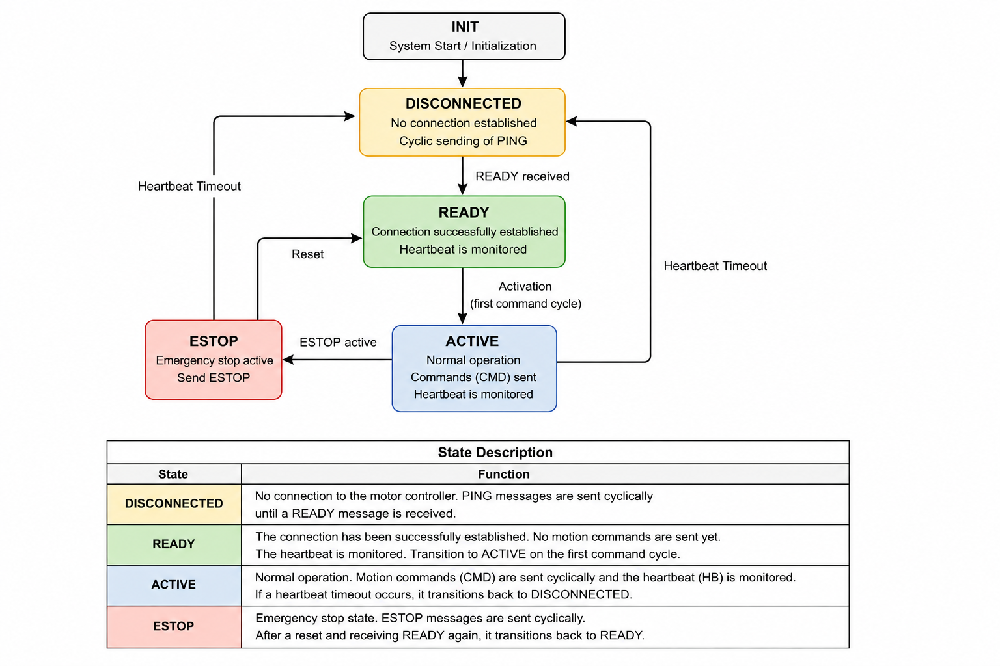

# Communication

The **HSK-Mensabot** uses a custom binary serial communication protocol between the ROS2 hardware interface running on the Raspberry Pi and the Arduino-based motor controller. The protocol has been designed to provide reliable command transmission, communication monitoring and fault detection while remaining lightweight and easy to extend.

The communication layer forms the interface between the ROS2 software stack and the physical robot hardware.

---

# 1. Communication Architecture

The communication architecture connects the ROS2 control framework with the Arduino motor controller using a binary UART protocol.

  

*(Recommended: Raspberry Pi ↔ UART ↔ Arduino communication diagram.)*

The communication process consists of the following steps:

- The Hardware Interface receives wheel velocity commands from `ros2_control`.
- A binary communication packet is generated.
- The packet is transmitted via the serial UART interface.
- The Arduino validates and processes the received packet.
- Motion commands are forwarded to the servo motors.
- Status information is transmitted back to the Raspberry Pi.

This separation allows the ROS2 software to remain hardware-independent while the Arduino performs the low-level motor control.

---

# 2. Communication Pipeline

The communication between ROS2 and the motor controller follows a fixed sequence.

1. Nav2 generates a velocity command.
2. The Diff Drive Controller converts the command into wheel velocities.
3. The Hardware Interface creates a binary communication packet.
4. The packet is transmitted via the serial interface.
5. The Arduino validates the received packet.
6. The command is processed by the communication state machine.
7. The motor controller executes the requested wheel motion.

This deterministic communication pipeline ensures predictable robot behavior and simplifies debugging.

---

# 3. Packet Structure

The communication protocol uses compact binary packets to exchange commands and status information.

| Field | Description |
|--------|-------------|
| Header 1 | Packet synchronization |
| Header 2 | Packet synchronization |
| Packet Type | Command identifier |
| Value 1 | First payload value |
| Value 2 | Second payload value |
| Checksum | Packet validation |

The packet structure enables reliable communication while minimizing transmission overhead. Packet headers simplify synchronization after transmission errors, while the checksum detects corrupted packets before command execution.

---

# 4. Communication State Machine

The Arduino firmware implements a communication state machine to supervise the connection with the ROS2 hardware interface.

  

The communication state machine consists of the following operating states.

| State | Description |
|--------|-------------|
| **INIT** | System startup and initialization. |
| **DISCONNECTED** | No active connection. Periodically sends PING packets while waiting for the hardware interface. |
| **READY** | Communication has been established successfully. Heartbeat monitoring is active, but no motion commands are executed yet. |
| **ACTIVE** | Normal operating mode. Motion commands are processed continuously while the heartbeat is monitored. |
| **ESTOP** | Emergency stop state. Motion commands are blocked until the system has been reset. |

The state machine guarantees controlled transitions between operating modes and prevents invalid command execution during initialization, communication failures or emergency stop conditions.

---

# 5. Safety Mechanisms

Several safety mechanisms have been integrated into the communication protocol to improve reliability.

| Mechanism | Purpose |
|-----------|---------|
| Packet Headers | Detect packet synchronization errors |
| Checksum | Detect transmission errors |
| Heartbeat Monitoring | Detect communication loss |
| Communication State Machine | Prevent invalid state transitions |
| Emergency Stop Messages | Ensure immediate reaction to emergency conditions |

Whenever communication is interrupted or corrupted, the protocol automatically returns to a safe operating state and prevents further motion commands from being executed.

---

# 6. Communication Parameters

The communication interface uses the following configuration.

| Parameter | Value |
|-----------|------:|
| Communication Interface | UART over USB |
| Baud Rate | 115200 Baud |
| Data Format | Binary Protocol |
| Communication Direction | Full Duplex |
| Packet Validation | Checksum |

These parameters provide a reliable communication channel while keeping latency low enough for real-time robot control.

---

# 7. ROS Interfaces

The communication layer exchanges information with the ROS2 ecosystem through a small number of dedicated interfaces.

| Interface | Direction | Description |
|-----------|-----------|-------------|
| `/cmd_vel` | Input | Desired robot velocity |
| `/hardware/connected` | Output | Reports the communication status between the hardware interface and the Arduino |
| `/odom` | Output | Wheel odometry generated from the hardware interface |
| Serial UART | Bidirectional | Binary communication between Raspberry Pi and Arduino |

These interfaces isolate the communication layer from higher software components and provide a clear separation between ROS2 and the embedded controller.

---

# Related Documentation

Further information about related software components can be found in the following documentation.

- **[Software Architecture](../architecture/)**
- **[Navigation Documentation](../navigation/)**
- **[Safety Documentation](../safety/)**
- **[Hardware Documentation](../hardware/)**

Together, these documents describe the complete communication chain from the ROS2 navigation stack to the physical servo motors of the **HSK-Mensabot**.