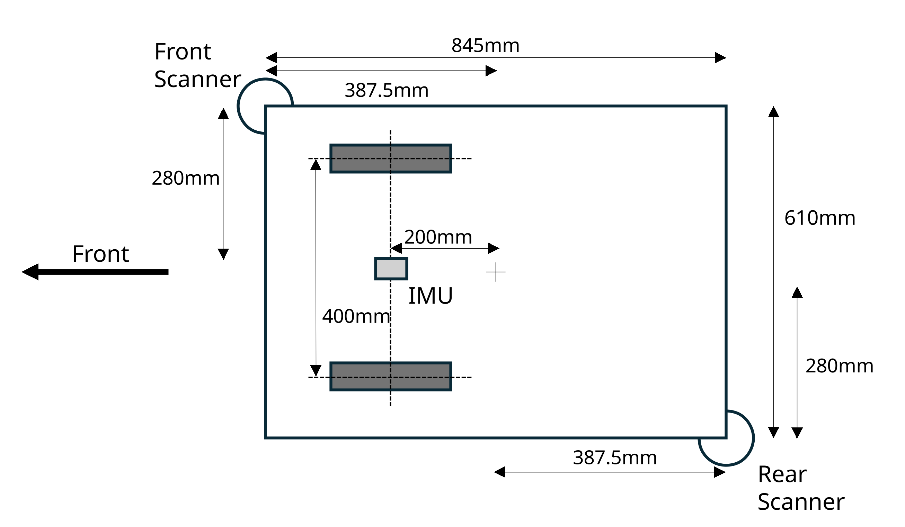
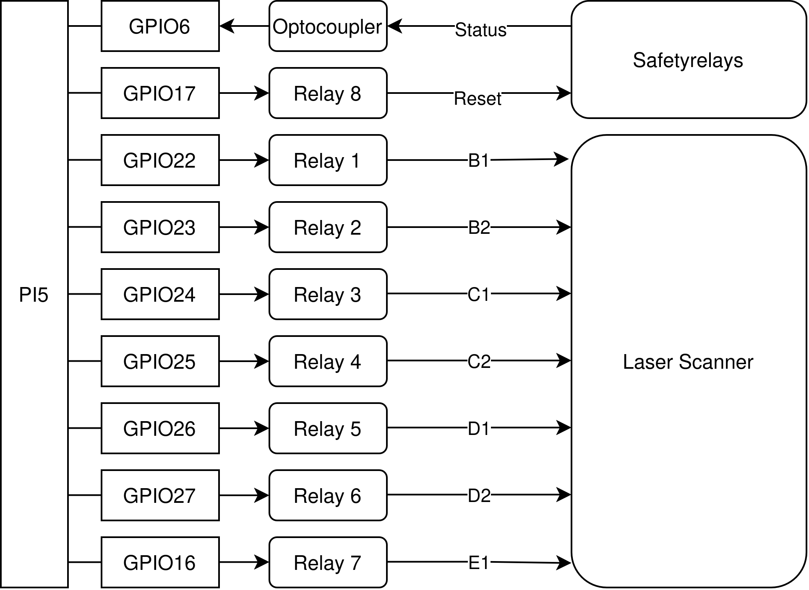

# Hardware

The **HSK-Mensabot** is built on a modular hardware platform consisting of a Raspberry Pi 5, an Arduino-based motor controller, two SICK NanoScan3 safety laser scanners, an IMU, certified safety hardware and two integrated servo motors. The hardware architecture is designed to provide a clear separation between high-level robot software and low-level hardware control while allowing easy maintenance and future extensions.

---

# 1. Hardware Overview

The following figure provides an overview of the hardware layout of the HSK-Mensabot and the position of the main components.

The main hardware components are summarized below.

| Component | Purpose |
|-----------|---------|
| Raspberry Pi 5 | Main robot computer running ROS2 |
| Arduino Uno | Low-level motor controller |
| SICK NanoScan3 (Front) | Front safety laser scanner |
| SICK NanoScan3 (Rear) | Rear safety laser scanner |
| Yahboom IMU | Orientation and angular velocity measurement |
| Servo Motors | Robot propulsion |
| Safety Relay | Certified hardware safety system |

---

# 2. Hardware Architecture

The hardware architecture separates perception, navigation and motor control into dedicated hardware components connected through standardized interfaces.

  

The Raspberry Pi executes the complete ROS2 software stack including localization, navigation and safety supervision. Sensor information from the laser scanners and the IMU is processed on the Raspberry Pi, while motion commands are transmitted to the Arduino motor controller. The Arduino is responsible for the real-time control of the integrated servo motors.

---

# 3. Robot Specifications

The most important technical specifications of the HSK-Mensabot are listed below.

| Specification | Value |
|---------------|-------|
| Length | 845 mm |
| Width | 610 mm |
| Height | 400 mm |
| Drive Type | Differential Drive |
| Maximum Velocity | 0.5 m/s |
| Main Computer | Raspberry Pi 5 |
| Motor Controller | Arduino Uno |
| Operating System | Ubuntu 24.04 LTS |
| ROS Version | ROS2 Jazzy Jalisco |

---

# 4. Hardware Connections

## 4.1 Communication Interfaces

The hardware components communicate using dedicated physical interfaces optimized for their respective applications.

| Device | Interface |
|---------|-----------|
| Front SICK NanoScan3 | Ethernet |
| Rear SICK NanoScan3 | Ethernet |
| Arduino Uno | USB |
| Yahboom IMU | USB |
| Safety Relay | GPIO |

The communication interfaces provide a clear separation between sensor communication, motor control and safety-related signals.

---

## 4.2 GPIO Connections

The Raspberry Pi GPIO interface is used to communicate with the external safety hardware. Digital outputs control the active monitoring cases of the SICK NanoScan3 safety scanners, while dedicated GPIO lines are used to reset the safety relays and monitor their status.

The following diagram illustrates the GPIO assignment and the electrical connections between the Raspberry Pi, the relay board, the safety relays and the laser scanners.

  

The GPIO interface provides a simple and reliable hardware abstraction for controlling the different safety monitoring cases while allowing the software to monitor the current safety status of the robot.

---

# 5. Hardware Components

Detailed information about the individual hardware components is available in the dedicated documentation.

| Component | Documentation |
|-----------|---------------|
| IMU | [IMU Documentation](imu/) |
| LiDAR | [LiDAR Documentation](lidar/) |
| Motors | [Motor Documentation](motors/) |

Each section contains hardware descriptions, configuration files, technical specifications and additional resources.

---

# 6. Additional Documentation

The detailed hardware documentation includes:

- Technical specifications
- Configuration files
- Datasheets
- Wiring information
- Images
- Manufacturer documentation

This structure keeps the hardware overview concise while providing comprehensive information for each individual subsystem.

---

# Related Documentation

- **[Architecture](../architecture/)**
- **[Communication](../communication/)**
- **[Navigation](../navigation/)**
- **[Safety](../safety/)**
- **[Network](../network/)**
- **[Installation](../installation/)**