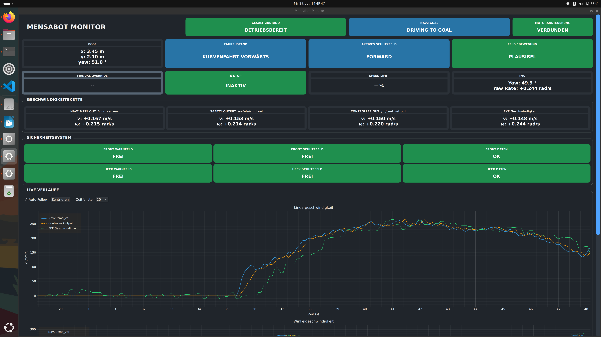

# Monitoring

The **MensaMonitor** is a lightweight monitoring tool for the **HSK-Mensabot**. It provides a graphical interface for observing the current robot state during development, testing and debugging.

The application subscribes to the relevant ROS2 topics and presents important system information in a single window, making it easier to monitor the robot while it is operating.

---

<p align="center">
  
</p>

---

# 1. Features

The monitoring tool provides a real-time overview of the robot status, including information such as:

- Robot state
- Motion information
- Safety status
- Hardware status
- Additional diagnostic information published by the ROS2 system

The displayed information is updated continuously while the robot is running.

---

# 2. Launch

The monitoring tool can be started directly using Python.

```bash
python3 src/mensabot_utils/mensabot_utils/MensaMonitor.py
```

No additional configuration is required. The application automatically connects to the available ROS2 topics after startup.

---

# 3. Source Code

The implementation of the monitoring tool can be found in:

- **[`src/mensabot_utils/mensabot_utils/MensaMonitor.py`](../../src/mensabot_utils/mensabot_utils/MensaMonitor.py)**

---

# Related Documentation

- **[Launch](../launch/)**
- **[Communication](../communication/)**
- **[Safety](../safety/)**
- **[Navigation](../navigation/)**