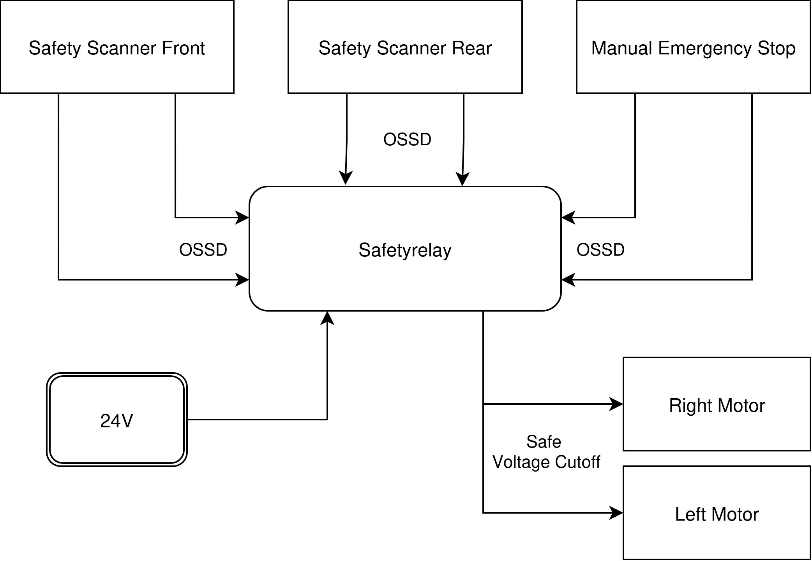

# Safety

The **HSK-Mensabot** combines certified hardware safety components with additional software-based safety mechanisms. The hardware safety system is responsible for personnel protection and operates independently of the robot software, while the software layer improves operational safety by supervising the robot state, monitoring communication, and controlling additional safety functions.

This separation ensures that the certified safety components remain fully functional even in the event of a software or controller failure, while software-based mechanisms provide additional protection during normal robot operation.

---

# 1. Safety Architecture

The HSK-Mensabot implements a two-layer safety concept consisting of an independent hardware safety circuit and a software-based safety layer.

<p align="center">
  
</p>

The certified hardware safety system consists of:

* Two SICK NanoScan3 safety laser scanners
* Safety relay
* Manual emergency stop
* Safe power shutdown of both servo drives

The software safety layer supervises the robot state, monitors communication, manages dynamic safety fields and validates motion commands before they are transmitted to the hardware interface.

---

# 2. Hardware Safety

Personnel protection is provided exclusively by certified hardware components.

The front and rear safety laser scanners continuously monitor the surroundings of the robot. Both scanners are connected to a certified safety relay through their OSSD outputs. A manual emergency stop is integrated into the same safety circuit.

Whenever one of the following events occurs

* Protective field violation
* Manual emergency stop
* Internal scanner fault

the safety relay immediately disconnects the power supply of both servo drives. At the same time, the integrated motor brakes engage and safely stop the robot.

> **Important**
> The ROS2 software, Raspberry Pi and robot controller are **not** part of the certified safety circuit. Hardware safety remains fully operational even if the robot software or controller fails.

---

# 3. Software Safety

In addition to the certified hardware safety system, the HSK-Mensabot implements several software-based safety mechanisms that improve operational safety during normal robot operation.

These functions are **not** safety-certified and do not replace the hardware safety system.

| Function                 | Description                                                          |
| ------------------------ | -------------------------------------------------------------------- |
| Safety Control Node      | Central software safety supervision                                  |
| Speed Limitation         | Reduces robot speed inside warning fields                            |
| Emergency Stop Handling  | Prevents motion commands after an emergency stop                     |
| Communication Monitoring | Stops the robot when communication with the motor controller is lost |
| Hardware Monitoring      | Detects hardware connection failures                                 |
| Dynamic Field Selection  | Selects the active safety field depending on the current motion      |
| Dynamic Footprint        | Synchronizes the Nav2 footprint with the active monitoring case      |

Together, these software functions improve the robustness of the robot while leaving all personnel protection to the certified hardware safety system.

---

# 4. Dynamic Safety Fields

Different robot movements require different monitoring areas. Therefore, the HSK-Mensabot uses multiple monitoring cases that are automatically selected depending on the current robot motion.

| Monitoring Case | Purpose                                   |
| --------------- | ----------------------------------------- |
| Forward         | Driving forward                           |
| Reverse         | Driving backward                          |
| Rotate Left     | Left rotation                             |
| Rotate Right    | Right rotation                            |
| Standstill      | Stationary robot                          |
| Empty           | Manual recovery without protective fields |

The Safety Control Node automatically selects the appropriate monitoring case and simultaneously updates the robot footprint used by Nav2. This ensures that the navigation system and the active safety fields remain synchronized.

> **Empty Monitoring Case**
> The **Empty** monitoring case disables all protective fields and is intended exclusively for manual recovery procedures. It cannot be selected automatically during normal robot operation and should only be used by the operator when recovering the robot from situations where an active protective field prevents further movement.

> **Manual Override**  
> The **Empty** monitoring case can be activated manually by publishing a `true` value to the `/safety/manual_override` topic. The manual override remains active for a limited time before the system automatically returns to the normal field selection.

```bash
ros2 topic pub --once /safety/manual_override std_msgs/msg/Bool "{data: true}"
```

---

# 5. Safety Features

Not all safety functions are available in both operating modes. The following table summarizes the implemented features.

| Safety Feature                    | Simulation | Real Robot |
| --------------------------------- | :--------: | :--------: |
| Emergency Stop Handling           |      ✓     |      ✓     |
| Communication Monitoring          |      ✗     |      ✓     |
| Hardware Monitoring               |      ✗     |      ✓     |
| Dynamic Field Selection           |      ✓     |      ✓     |
| Dynamic Robot Footprint           |      ✓     |      ✓     |
| Warning Field Speed Limitation    |      ✗     |      ✓     |
| Protective Fields                 |      ✗     |      ✓     |
| Safety Relay                      |      ✗     |      ✓     |
| Certified Hardware Safety Circuit |      ✗     |      ✓     |

The Gazebo simulation does not provide certified warning or protective fields. Therefore, software functions that depend on the safety laser scanners, such as speed reduction inside warning fields, are only available on the physical robot.

---

# 6. Simulation and Real Robot

The software architecture remains nearly identical for both operating modes. However, only the physical HSK-Mensabot includes certified hardware safety components.

| Function             | Simulation        | Real Robot                                  |
| -------------------- | ----------------- | ------------------------------------------- |
| Safety Logic         | Software only     | Software + Certified Hardware               |
| Emergency Stop       | Software handling | Manual emergency stop and software handling |
| Safety Fields        | Not available     | Warning and protective fields               |
| Safe Motor Shutdown  | Not available     | Safety relay disconnects motor power        |
| Personnel Protection | Not applicable    | Certified hardware safety system            |

This approach allows nearly the entire software stack to be tested inside Gazebo while maintaining full hardware safety on the physical robot.

---

# Related Documentation

Further information about the safety-related software and hardware components can be found in the following documentation.

* **[Software Architecture](../architecture/)**
* **[Navigation Documentation](../navigation/)**
* **[Hardware Documentation](../hardware/)**
* **[Communication Documentation](../communication/)**

Additional information regarding the implementation and verification of the safety concept is available in the accompanying bachelor thesis. The GitHub documentation focuses on the implemented architecture and software behavior rather than the detailed safety calculations and certification process.
