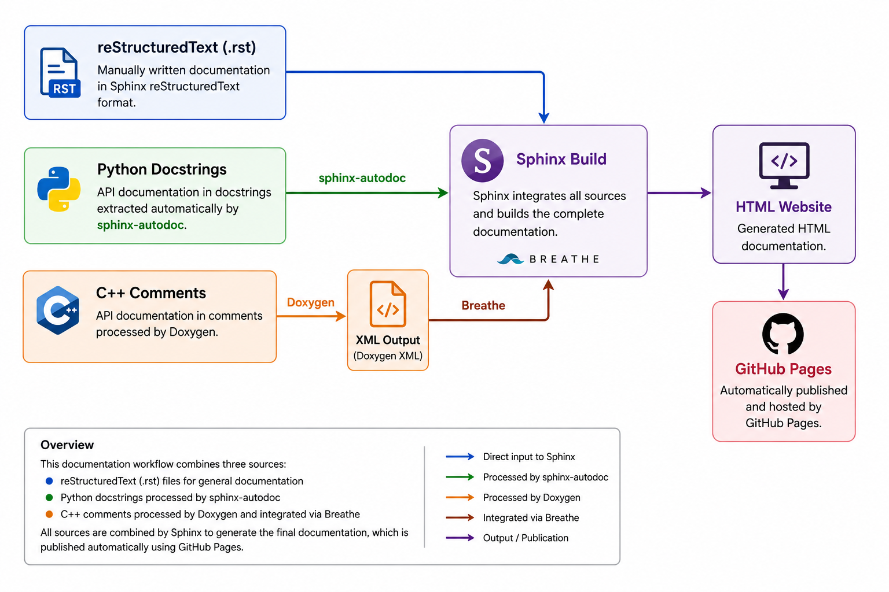

Documentation
=============

The HSK-MensaBot project documentation is generated using a combination of Sphinx, Doxygen and GitHub Pages. This workflow combines manually written documentation with automatically generated API references to provide a consistent and maintainable documentation system.

Documentation Workflow
----------------------

The documentation is generated from several sources. Markdown and reStructuredText documents form the main documentation, while Python and C++ source code are processed automatically to generate the API reference.

The complete documentation workflow is illustrated below:

   Overview of the Mensabot documentation architecture.

Sphinx
------

Sphinx is used as the primary documentation framework. It generates the complete HTML documentation from the reStructuredText source files and integrates both the Python and C++ API documentation into a single documentation website.

The documentation can be generated locally using:

.. code-block:: bash

   cd docs
   make html

The generated HTML files are stored in:

.. code-block:: text

   docs/build/html/

Python API Documentation
------------------------

The Python API documentation is generated automatically using the Sphinx ``autodoc`` extension. Module documentation, classes and functions are extracted directly from the Python docstrings, ensuring that the API reference always reflects the current implementation.

Whenever Python source code is modified, the API documentation is updated automatically during the next Sphinx build.

C++ API Documentation
---------------------

The C++ API documentation is generated using Doxygen. Source code comments are converted into XML files, which are subsequently imported into Sphinx through the Breathe extension.

Generate the Doxygen XML files using:

.. code-block:: bash

   doxygen Doxyfile

The generated XML files are written to:

.. code-block:: text

   docs/build/doxygen/xml/

Configuration
-------------

The documentation system is configured using several configuration files located inside the ``docs`` directory.

+----------------------+--------------------------------------+------------------------------------------------------------------+
| File                 | Purpose                              | Description                                                      |
+======================+======================================+==================================================================+
| ``conf.py``          | Sphinx configuration                 | Main Sphinx configuration including extensions and theme.        |
+----------------------+--------------------------------------+------------------------------------------------------------------+
| ``Doxyfile``         | Doxygen configuration                | Configuration used to generate the C++ XML documentation.        |
+----------------------+--------------------------------------+------------------------------------------------------------------+
| ``Makefile``         | Documentation build                  | Provides build targets such as ``make html``.                    |
+----------------------+--------------------------------------+------------------------------------------------------------------+
| ``requirements.txt`` | Python dependencies                  | Lists the required Python packages for documentation generation. |
+----------------------+--------------------------------------+------------------------------------------------------------------+

GitHub Pages
------------

The published project documentation is hosted using GitHub Pages. After changes have been committed and pushed to the repository, GitHub Actions automatically builds the documentation and publishes the generated HTML pages.

This allows the latest version of the documentation to be accessed directly through the project's GitHub Pages website without requiring a local Sphinx installation.

Documentation Maintenance
-------------------------

To keep the documentation synchronized with the implementation, the following workflow is recommended:

1. Update the source code.
2. Update the corresponding Python docstrings or Doxygen comments.
3. Regenerate the Doxygen XML files (if C++ code was modified).
4. Build the Sphinx documentation locally.
5. Verify the generated HTML pages before committing changes.
6. Push the changes to the repository to trigger automatic publication via GitHub Pages.